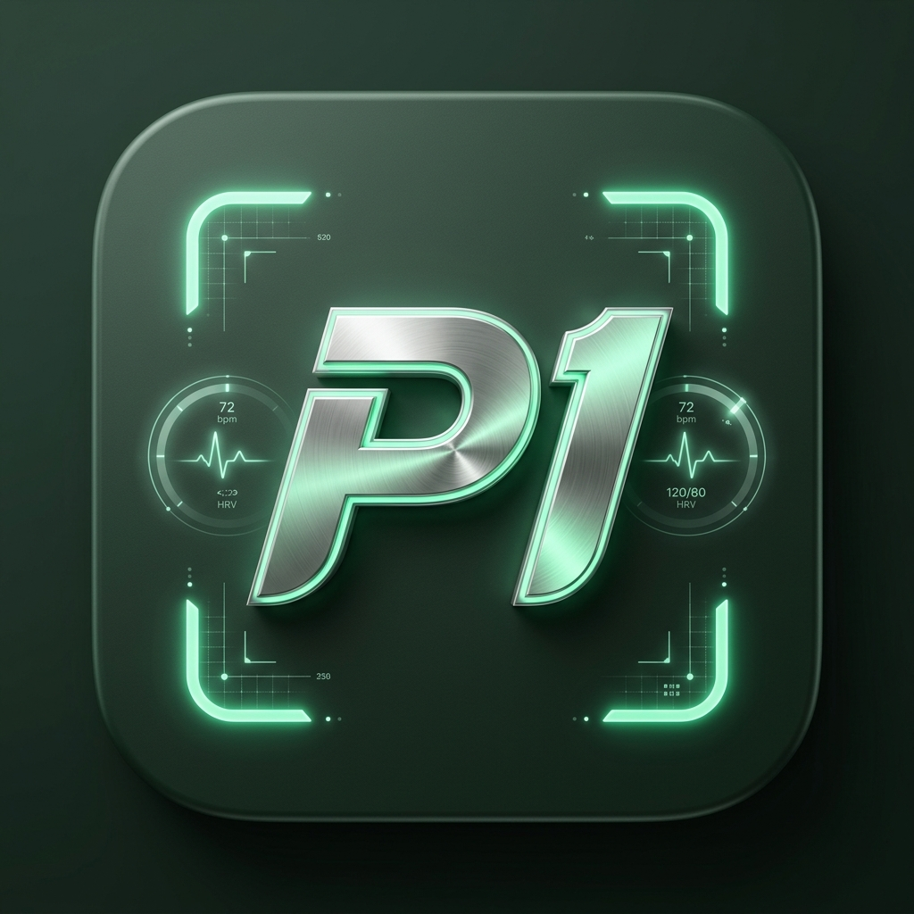
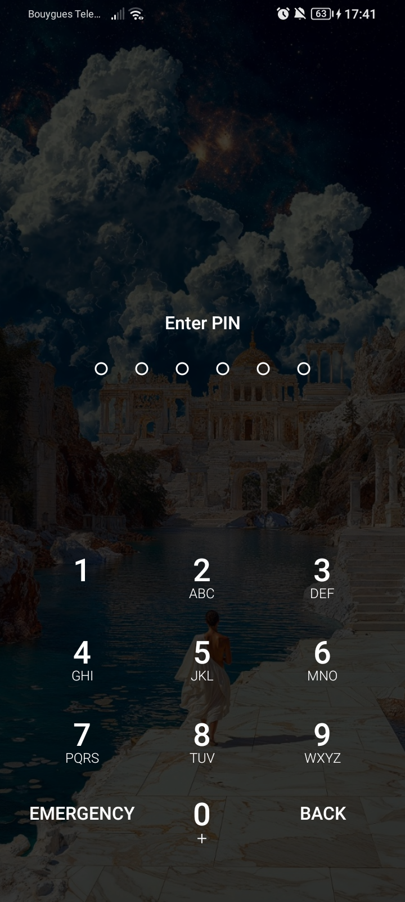
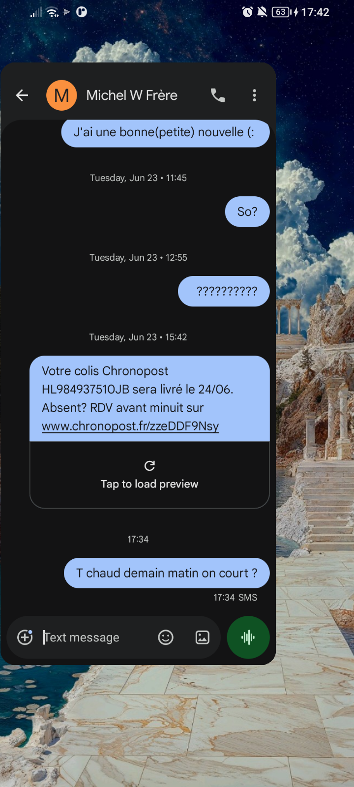
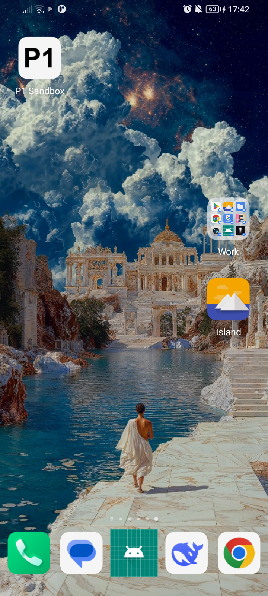
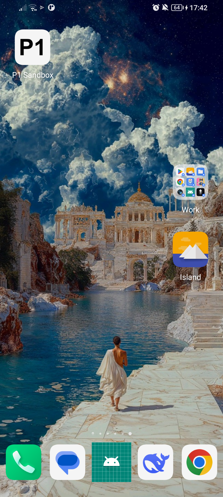

# 🌿 P1 — Pre-Appointment 1 & Living Patient Memory

<div align="center">
  
  
  <h3><strong>Next-Gen AI Pre-Appointment & Clinical Memory Mobile Companion</strong></h3>
  <p><em>Prepare crystal-clear, structured clinical briefings for your doctor — in under 2 minutes a day.</em></p>

  <p>
    
    
    
    
  </p>
</div>

---

## 🎨 New P1 Logo Redesigns (Sage & Mint Theme)

Inspired by the high-tech medical HUD scanner aesthetic, redesigned to perfectly harmonize with the new **Stitch Sage Green (`#2D5A47`)** and **Fresh Mint (`#C4E8D6`)** color palette.

<div align="center">
  <table>
    <tr>
      <th align="center">✨ Variation 1: Sage HUD Scanner (Primary)</th>
      <th align="center">⚡ Variation 2: Emerald Precision Badge</th>
    </tr>
    <tr>
      <td align="center">
        
        <br />
        <em>Dynamic italic P1 monogram, glowing mint HUD scanning viewfinder brackets, and real-time biometric vitals rings.</em>
      </td>
      <td align="center">
        
        <br />
        <em>Beveled metallic titanium badge with deep emerald illumination and clinical telemetry indicators.</em>
      </td>
    </tr>
  </table>
</div>

---

## 📱 Application Overview & Live Screenshots

<table>
  <tr>
    <th align="center">🏠 1. Home Screen (Stitch)</th>
    <th align="center">📊 2. Timeline & 3D Journey</th>
  </tr>
  <tr>
    <td align="center">
      
      <br /><br />
      <strong>Real-time Patient 1 Greeting</strong>
      <br />
      <em>Micro-sentiment check-in (Better / Same / Worse), one-tap voice logger, and live 7-day wellbeing wave computed from patient entries.</em>
    </td>
    <td align="center">
      
      <br /><br />
      <strong>Interactive 3D Body & Chronology</strong>
      <br />
      <em>Rotate and pinpoint symptoms on the 3D mannequin, view scheduled protocol check-ins, and inspect chronological logs.</em>
    </td>
  </tr>
  <tr>
    <th align="center">📁 3. Preparation Folder</th>
    <th align="center">📂 4. Side Navigation Drawer</th>
  </tr>
  <tr>
    <td align="center">
      
      <br /><br />
      <strong>Secure On-Device Storage</strong>
      <br />
      <em>Store clinical PDF reports, prescription photos, and lab results safely on-device with smart category badges.</em>
    </td>
    <td align="center">
      
      <br /><br />
      <strong>Files & Reminder Management</strong>
      <br />
      <em>Switch between active appointment files, initiate new consultations, and adjust gentle protocol reminder schedules.</em>
    </td>
  </tr>
</table>

---

## ⚡ Key Highlights & Architecture

### 🎙️ 1. Intelligent Voice Check-in
- **Real-Time Speech Recognition**: Speak naturally about how you feel. Uses native on-device Android recognizer with fallback support.
- **Direct Timeline Integration**: Voice transcripts are automatically committed to the local `TimelineRepository` and synchronized to the active file.
- **AI Clinical Extraction**: Gemini parses symptoms, intensity, and chronology in the background.

### 📈 2. 100% Real Patient Data & Dynamics
- **Zero Hardcoded Dummy Graphs**: The 7-day wellbeing trend card computes spline curves dynamically from recorded pain scores, vitals, and daily sentiment logs.
- **Readiness Metric**: Calculates real progress toward appointment day based on completed protocol tasks.

### 🌐 3. Full i18n Localization (English & French)
- Complete semantic string separation in `res/values/strings.xml` and `res/values-fr/strings.xml`.
- Auto-detects device language to deliver a seamless native experience.

### 🧩 4. Decoupled Clean Architecture
- **`AppNavigation.kt`**: Modular navigation router handling bottom navigation persistence, deep links, and screen transitions (`Crossfade`).
- **`LocalRepositories.kt`**: Offline-first Room database repository with background synchronization (`SyncManager`).
- **`Theme.kt`**: Curated Stitch design tokens (`SagePrimary`, `MintBadge`, `CanvasBackground`, `CardBackground`).

---

## 🛠️ Build & Installation

```bash
# Navigate to the Android project directory
cd androidp1

# Compile Debug APK
./gradlew assembleDebug

# Install directly to connected ADB device
./gradlew installDebug

# Launch the app on phone
adb shell am start -n com.preappointment1.designsandbox/com.preappointment1.app.MainActivity
```

---

<div align="center">
  <sub>Developed with Google Stitch & Jetpack Compose. Built for the Hackathon.</sub>
</div>
