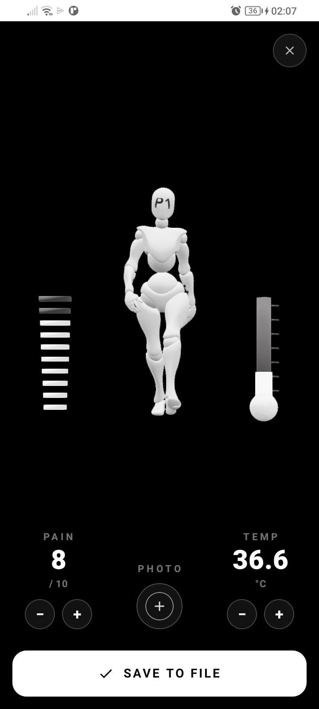
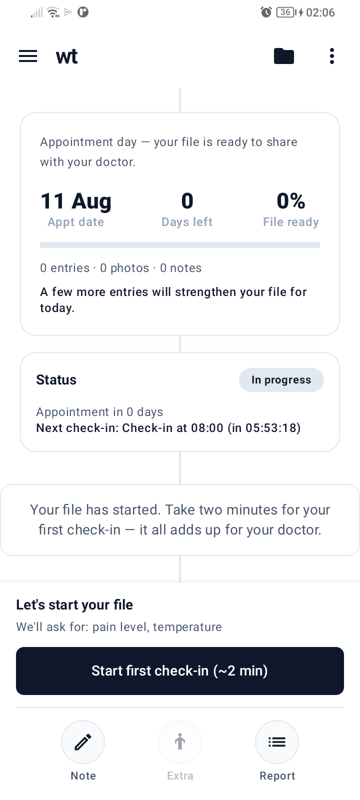

# Pre-Appointment 1

**Walk into your next appointment with a file ready — not with half-remembered details.**

[Pre-Appointment 1](https://play.google.com/store/apps/details?id=com.preappointment1.app) (P1) is your daily companion for the days and weeks before an important meeting with a doctor, specialist, or advisor. It turns short check-ins into a clear briefing so those precious minutes are spent on decisions, not reconstruction.

  

**Current release:** v1.0.14 · Android on [Google Play](https://play.google.com/store/apps/details?id=com.preappointment1.app) · iOS coming soon

  
  &nbsp;
  

<em>Daily check-in with 3D body map · Your file building toward appointment day</em>

Mini walkthrough: [`store-assets/presentation/p1_presentation.mp4`](store-assets/presentation/p1_presentation.mp4)

---

## Why it exists

When you finally sit down with a specialist, the useful information is often already gone.

Pain that peaked three weeks ago lives only in memory. A rash that changed day by day was never photographed. Temperature spikes were never logged. The consultation becomes archaeology — and decisions wait.

**P1 captures what happens between appointments**, so your advisor sees the full story in one place.

---

## What you get

### A file that builds itself

Each day, P1 asks for a short update — about two minutes. Pain level. Temperature. A photo when something is changing. Over time, that becomes a structured file for appointment day.

### See it. Mark it. Capture it.

A 3D mannequin lets you show *where* something hurts, not just describe it. Floating instruments for pain and temperature. Photos linked to the exact spot on the body.

### One briefing for your doctor

Graphs, photos, and daily notes compiled into a single page. Open it together. Skip the “when did it start?” scramble.

### Built for real life

Reminders that fit your schedule. Works when you are tired, stressed, or simply forgetful. No diagnosis. No alarms. Just a reliable record you control.

---

## Who it is for

- Anyone preparing for a medical appointment or follow-up
- People who want their pain and symptoms taken seriously with facts, not only memory
- Caregivers helping a loved one keep a consistent log between visits

---

## Privacy, simply

Your observations matter. This beta uses a secure cloud backend so early features can ship and improve. You can request full deletion of your data at any time.

The long-term vision is a **private, user-owned setup** — so your file stays yours. That path is already designed into the product.

---

## Get started

1. [Install on Google Play](https://play.google.com/store/apps/details?id=com.preappointment1.app)
2. Open your appointment file
3. Do today’s check-in — pain, temp, photo if needed
4. Keep going until appointment day
5. Share the briefing with your doctor

---

## What P1 is not

- Not a diagnostic tool
- Not a replacement for a clinician
- Not another place for your health data to disappear into a black box

It is a preparation tool: **better meetings, because the facts arrived with you.**

---

## Support

- Play Store: [Pre-Appointment 1](https://play.google.com/store/apps/details?id=com.preappointment1.app)
- Website: [p1-website-9fb.pages.dev](https://p1-website-9fb.pages.dev)
- Email: [contact@livingpatientmemory.com](mailto:contact@livingpatientmemory.com)
- GitHub: [Group-Hackathon](https://github.com/Group-Hackathon)

---

*Hackathon project for XPRIZE Gemini · Productivity · Updated August 2026*
