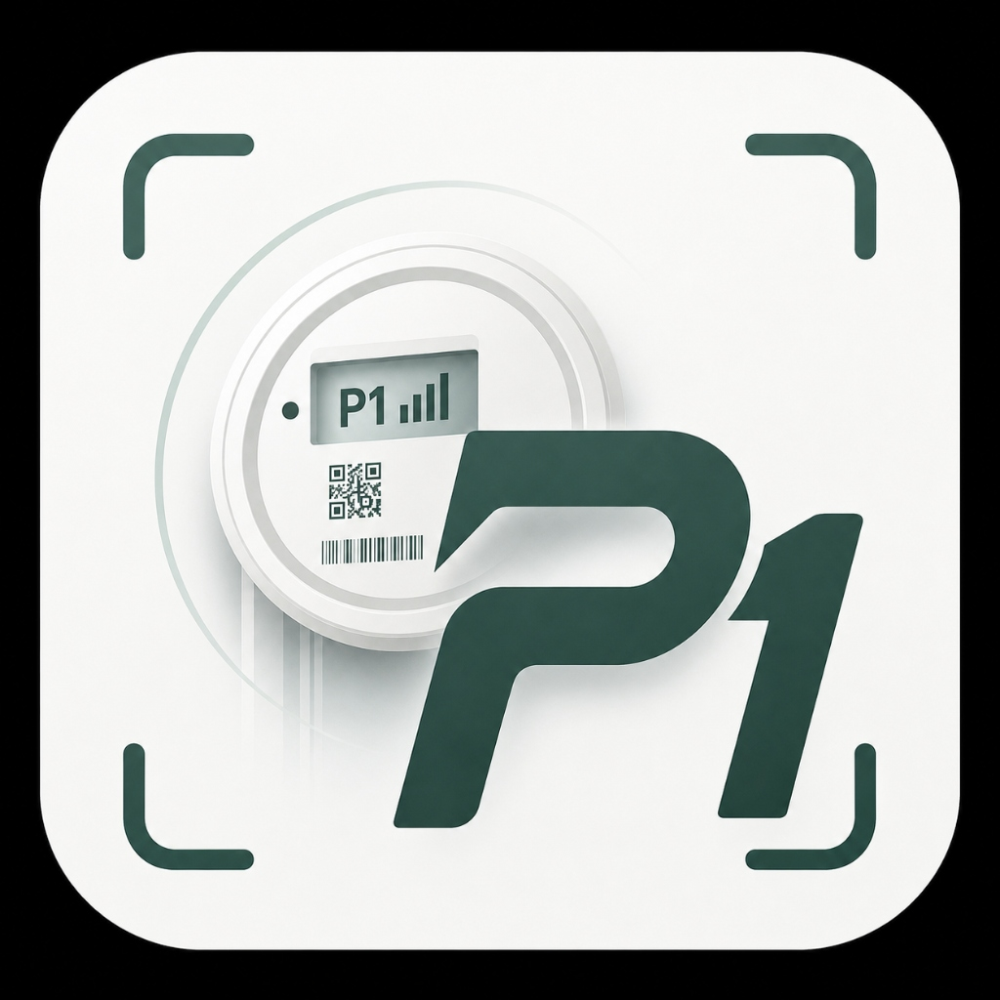
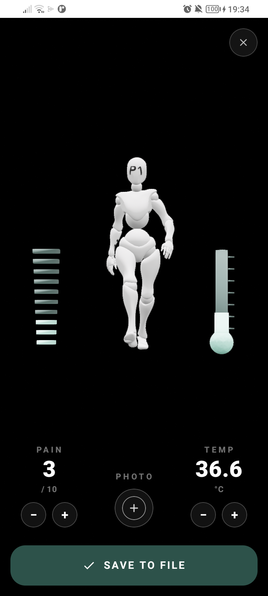
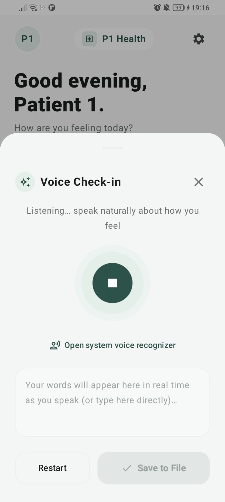
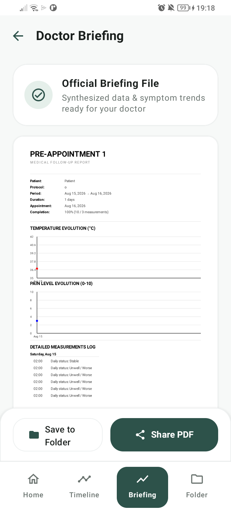

# P1 — Pre-Appointment 1 & Living Patient Memory

<div align="center">
  
  
  <h3><strong>Next-Gen AI Pre-Appointment & Clinical Memory Mobile Companion</strong></h3>
  <p><em>Prepare crystal-clear, structured clinical briefings for your doctor — in under 2 minutes a day.</em></p>

  <p>
    
    
    
    
  </p>
</div>

---

## I. Official Brand Identity

The official brand identity of **P1** embodies modern clinical precision and biometric telemetry:
- **Monogram**: Deep **Sage Green (`#2D5A47`)** bold italic **P1** emblem.
- **Biometric Telemetry**: High-precision circular gauge dial with active P1 signal bars, QR identification, and telemetry barcode.
- **Reticle HUD**: 4 rounded framing brackets representing continuous focus on the patient's living clinical memory.

<div align="center">
  
  <br /><br />
  <em>Official P1 Application Launcher & Brand Asset</em>
</div>

---

## II. Interactive 3D Anatomy & Robot Mannequin

The core interactive experience of P1 features a full 3D robot body model that allows patients to accurately map and report their symptoms with zero medical jargon:

<div align="center">
  <table>
    <tr>
      <th align="center">3D Robot Mannequin & Real-Time Biometric HUD</th>
    </tr>
    <tr>
      <td align="center">
        
        <br /><br />
        <em>Interactive 3D Robot Mannequin with P1 headmark, dual telemetry gauges (Pain ladder on the left, luminous mint thermometer on the right), photo attachment, and direct timeline commitment.</em>
      </td>
    </tr>
  </table>
</div>

---

## III. Complete Application Walkthrough & Verified Screenshots

<table>
  <tr>
    <th align="center">1. Home Screen (Patient 1)</th>
    <th align="center">2. Real-Time Voice Check-In</th>
  </tr>
  <tr>
    <td align="center">
      
      <br /><br />
      <strong>Real-Time Home Hub</strong>
      <br />
      <em>Personalized greeting for Patient 1, micro-sentiment selectors (Better / Same / Worse), one-tap voice logger, and active file readiness progress.</em>
    </td>
    <td align="center">
      
      <br /><br />
      <strong>Hands-Free Speech Logger</strong>
      <br />
      <em>Real-time speech-to-text listener with live transcript preview and direct one-tap commitment to the patient timeline.</em>
    </td>
  </tr>
  <tr>
    <th align="center">3. Timeline & Chronological Log</th>
    <th align="center">4. Official Doctor Briefing Report</th>
  </tr>
  <tr>
    <td align="center">
      
      <br /><br />
      <strong>Patient Chronology & Next Event</strong>
      <br />
      <em>Chronological nodes showing status updates, countdown to next scheduled check-in, quick notes, and access to the 3D robot body check-in.</em>
    </td>
    <td align="center">
      
      <br /><br />
      <strong>Clinical Synthesis PDF</strong>
      <br />
      <em>Automatically generated medical report featuring temperature curves, pain trends, and structured logs ready for consultation.</em>
    </td>
  </tr>
  <tr>
    <th align="center">5. Preparation Folder</th>
    <th align="center">6. Side Navigation Drawer</th>
  </tr>
  <tr>
    <td align="center">
      
      <br /><br />
      <strong>Secure On-Device Storage</strong>
      <br />
      <em>Consolidated preparation folder for prescriptions, lab PDF results, and symptom photos stored securely on device.</em>
    </td>
    <td align="center">
      
      <br /><br />
      <strong>Drawer & Reminder Management</strong>
      <br />
      <em>Full file switcher, new appointment creation flow, and protocol reminder configuration.</em>
    </td>
  </tr>
</table>

---

## IV. Architecture & Engineering Highlights

### 1. Connected Voice Check-In
- **Direct Timeline Integration**: Voice transcripts are automatically committed to the local `TimelineRepository` and synchronized to the active file.
- **Smart AI Summaries**: Symptoms and context are extracted without requiring manual form entry.

### 2. 100% Real Patient Data & Dynamics
- **Zero Hardcoded Dummy Graphs**: The 7-day wellbeing trend card computes spline curves dynamically from recorded pain scores, vitals, and daily sentiment logs.
- **Readiness Metric**: Calculates real progress toward appointment day based on completed protocol tasks.

### 3. Full i18n Localization (English & French)
- Complete semantic string separation in `res/values/strings.xml` and `res/values-fr/strings.xml`.
- Automatically adapts to system locale with zero missing keys.

### 4. Clean Modular Architecture
- **`AppNavigation.kt`**: Modular navigation router handling bottom navigation persistence, deep links, and screen transitions (`Crossfade`).
- **`LocalRepositories.kt`**: Offline-first Room database repository with background synchronization (`SyncManager`).
- **`Theme.kt`**: Curated Stitch design tokens (`SagePrimary`, `MintBadge`, `CanvasBackground`, `CardBackground`).

---

## V. Build & Installation

```bash
# Navigate to the Android project directory
cd androidp1

# Compile Debug APK
./gradlew assembleDebug

# Install directly to connected ADB device
./gradlew installDebug

# Launch the app on phone
adb shell am start -n com.preappointment1.designsandbox/com.preappointment1.app.MainActivity
```

---

<div align="center">
  <sub>Developed with Google Stitch & Jetpack Compose. Built for the Hackathon.</sub>
</div>
